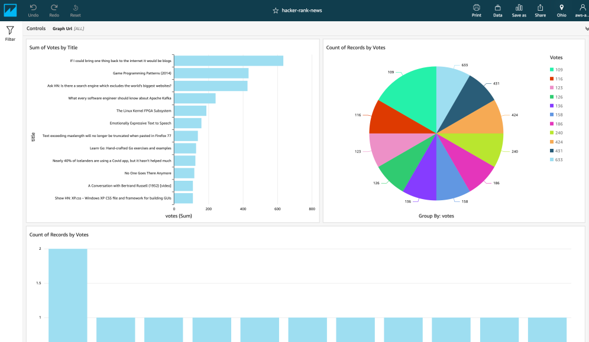

## Gather HackerNews Data


This project uses technologies like:
```
1) Python
2) AWS Lambda
3) AWS S3
4) AWS Glue
5) Athena
6) AWS QuickSight
```

### Introduction
This project is built for a learning purpose - to understand how the technologies works together to give the end result for one of my simple requirements. Daily I used to read articles from [Hacker News](https://news.ycombinator.com/). You can see that a large amount of articles
are updated in Hacker News, to find the interested one was difficult. I thought of combining these technologies to get the
data, I needed daily

### How It Works
I created an AWS Lambda function which is written in Python3.6 to scrap the data I needed from website and to perform a logic to get those articles which have more than 100 votes. This Lambda function get the reauired data and store that in AWS S3 as a json file

I used AWS Glue to crawl json data from S3 and create a catalog with this data. With this data an ETL (Extract Transfer Load) job is schduled to run which converts the data from json to parquet and stored back in Amazon S3

Having this data in S3, I executed another crawler to crawl through the parquet file and created the catalog. This database can be queried through SQL from AWS Athena. This is the fun part, we can run normal SQL queries on a file, which is sitting on S3

Amazon QuickSight uses Athena as the data source to visualize the data




```
Maintainer: Nikhil Narayanan [nikhilvkn@yahoo.com]
```
